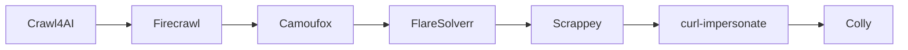

# Capas de adquisición (crawler)

Orden efectivo en `crawler/main.go` para cada URL (el primer método que devuelve HTML gana en ese escalón; los escalones 1–3 son por **lista de dominios** o `*`):

Cada flecha representa el **siguiente escalón** si el anterior no aplicó al dominio o devolvió vacío. Dentro del bloque final, el crawler usa **uno** de: FlareSolverr (si `FLARE_DOMAINS`) **o** Scrappey (clave + `SCRAPPEY_DOMAINS`) **o** curl **o** Colly.

**Proxies genéricos (rotación / residencial):**

- `COLLY_HTTP_PROXY`: prioridad sobre `TOR_PROXY` para el transporte HTTP de Colly.
- `CURL_HTTP_PROXY`: se pasa a curl como `-x` (TLS fingerprint sigue siendo el de curl-impersonate).

**Camoufox** es self-hosted (perfil compose `camoufox`). **Scrappey** es SaaS: requiere `SCRAPPEY_API_KEY` y facturación en su plataforma.

Véase también [`anti-cloudflare-acquisition.md`](anti-cloudflare-acquisition.md).
