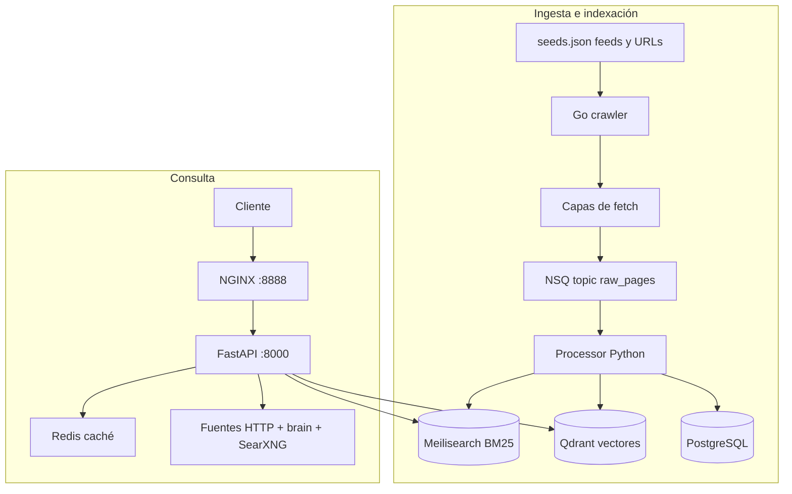

# Estado del proyecto MotorDeBusqueda

**Última actualización del documento:** 19 de abril de 2026  

Este archivo describe **cómo está el repositorio ahora mismo**: arquitectura, servicios, código, integraciones y límites conocidos. No sustituye a `README.md` para puesta en marcha rápida.

---

## 1. Qué es el proyecto

Monorepo de **motor de búsqueda híbrido** (tipo “F1” / InvestSearch según documentación interna):

- **Ingesta:** crawler en **Go** (productor **NSQ** `github.com/nsqio/go-nsq`) → cola **NSQ** (`nsqd` + `nsqlookupd`, topic **`raw_pages`**, bridge **`nsq_to_http`**) → **processor** en **Python** → **Meilisearch** (BM25) + **Qdrant** (vectores) + **PostgreSQL**. UI de inspección NSQ opcional: **`docker compose --profile nsqadmin up -d`** → `http://localhost:4171`.
- **Consulta:** **FastAPI** expone búsqueda y `/resolve` con **índice local** (Meilisearch + Qdrant, alimentado por el crawler) y **SearXNG como capa web principal** por defecto (`SEARXNG_AS_PRIMARY=1`): sin llamadas directas a APIs públicas de Wikipedia/OpenAlex/Wikidata; el descubrimiento pasa por SearXNG (motores agregados en `searxng/settings.yml`). Rutas opcionales “brain” (Firecrawl Agent, OpenPerplex, Vane) si las configuras.
- **Frontends de producto:** no hay SPA propia en el repo; la superficie pensada para clientes es la **API** (y NGINX delante).

Stack de contenedores: **Docker Compose** (`docker compose`); en VPS/CI se asume **Docker Engine**. Podman (`podman compose`) es opcional en desarrollo local.

---

## 2. Arquitectura (vista global)

### Flujo de datos (alto nivel)

Las **capas de fetch** del crawler (Crawl4AI → Firecrawl → Camoufox → Flare / Scrappey / curl / Colly) están detalladas en `integrations/acquisition-stack.md`.

### Dos pipelines lógicos

| Pipeline | Ruta en el sistema | Entrega |
|----------|-------------------|---------|
| **Ingesta** | `crawler` → NSQ → `processor` | Documentos en Meilisearch, embeddings en Qdrant, metadatos en PG. |
| **Consulta** | Cliente → NGINX → `api` | `/search` (híbrido Meili+Qdrant+RRF), `/resolve` (plan, fuentes externas, fusión, rerank, síntesis, `brain_boost`). |

### Componentes por rol

| Capa | Piezas principales |
|------|-------------------|
| **Adquisición** | Crawler Go, Crawl4AI, FlareSolverr, opc. Camoufox bridge, Scrappey (API), curl-impersonate, Colly, proxies `COLLY_HTTP_PROXY` / `CURL_HTTP_PROXY` / `TOR_PROXY`. |
| **Transporte** | NSQ (`raw_pages`), `nsq_to_http` → processor. |
| **Indexación** | Processor: embeddings, trust, dedup → Meili + Qdrant + PG. |
| **Búsqueda** | API: RRF, `query_plan`, `fusion`: **SearXNG** (descomposición + meta-motores) + índice local; sin APIs directas wiki/OpenAlex si `SEARXNG_AS_PRIMARY=1`. Rerank, síntesis. |
| **Motores remotos (opcional)** | Router `/brain`: Firecrawl Agent, OpenPerplex, Vane; `brain_boost` en `/resolve` (no son el núcleo por defecto). |

### Perfiles Compose (servicios no siempre activos)

| Perfil | Servicio | Puerto host típico | Función |
|--------|----------|----------------------|---------|
| `ollama` | `ollama` | 11434 | LLM local (plan Ollama, síntesis, etc.). |
| `nsqadmin` | `nsqadmin` | 4171 | Inspección NSQ en navegador. |
| `searxng` | `searxng` | 8088→8080 | Meta-búsqueda; monta `searxng/settings.yml` en `/etc/searxng/settings.yml`; API con `SEARXNG_URL=http://searxng:8080`. |
| `camoufox` | `camoufox-bridge` | no expuesto | `CAMOUFOX_URL=http://camoufox-bridge:8090`; build pesado. |

El **compose base** (sin perfiles) ya incluye postgres, NSQ, meilisearch, qdrant, redis, flaresolverr, crawl4ai, api, crawler, processor, nginx.

---

## 3. Estructura de carpetas (núcleo)

| Ruta | Rol |
|------|-----|
| `api/` | FastAPI: `/health`, `/search`, `/resolve`, router `/brain/*`, pipeline de fusión y síntesis |
| `crawler/` | Binario Go: feeds + URLs semilla → NSQ; fetch por capas (ver `integrations/acquisition-stack.md`) |
| `camoufox-bridge/` | FastAPI + Camoufox: `POST /v1/fetch` (perfil compose `camoufox`) |
| `processor/` | Python: ingesta HTTP desde NSQ, embeddings, deduplicación, escritura a Meili/Qdrant/PG |
| `nginx/` | Reverse proxy frente a la API (puerto 8888 host) |
| `migrations/` | SQL inicial PostgreSQL |
| `searxng/` | `settings.yml` — motores y categorías para la instancia SearXNG (volumen en compose) |
| `integrations/` | Firecrawl, OpenPerplex, anti-CF, **acquisition-stack**, Camoufox bridge, Scrappey |
| `scripts/` | `start-all.ps1` (Docker por defecto; `-UsePodman` opcional), `dev-podman.ps1` |
| `GUIA_SCRAPER_MOTOR_IA_2026.md` | Guía larga de arquitectura scrapers + motores IA (referencia) |
| `PLAN_DE_TRABAJO.md` / `PLAN_DE_TRABAJO1.md` | Planificación / contexto histórico |

---

## 4. Servicios en `docker-compose.yml`

| Servicio | Imagen / build | Puerto host (típico) | Notas |
|----------|----------------|----------------------|--------|
| `postgres` | `postgres:16-alpine` | 5432 | Datos relacionales; migraciones montadas |
| `nsqlookupd`, `nsqd` | `nsqio/nsq:v1.2.1` | 4160/4161, 4150/4151 | Descubrimiento y broker del topic `raw_pages` |
| `nsqadmin` | `nsqio/nsq:v1.2.1` | 4171 | **Perfil `nsqadmin`** — interfaz web para topics/canales |
| `nsq_to_http` | nsq | — | Topic `raw_pages` → `POST processor:8080/internal/ingest` |
| `meilisearch` | `getmeili/meilisearch:v1.11` | 7700 | Índice `documents` |
| `qdrant` | `qdrant/qdrant:v1.12.5` | 6333, 6334 | Colección `documents` |
| `redis` | `redis:7-alpine` | 6379 | Caché, bloom del crawler, etc. |
| `flaresolverr` | `ghcr.io/flaresolverr/flaresolverr:latest` | **no expuesto** | API interna `http://flaresolverr:8191` |
| `crawl4ai` | `unclecode/crawl4ai:latest` | **no expuesto** | API interna `http://crawl4ai:11235/crawl` |
| `ollama` | `ollama/ollama:latest` | 11434 | **Perfil `ollama`**; opcional |
| `searxng` | `searxng/searxng:latest` | **8088→8080** | **Perfil `searxng`** — volumen `./searxng/settings.yml` → `/etc/searxng/settings.yml`; API con `SEARXNG_URL=http://searxng:8080` si `ENABLE_SEARXNG=1` |
| `camoufox-bridge` | build `./camoufox-bridge` | **no expuesto** | **Perfil `camoufox`** — HTTP interno `http://camoufox-bridge:8090`; build pesado (descarga Camoufox) |
| `api` | build `./api` | 8000 | FastAPI + sentence-transformers (volumen `hf_cache`) |
| `crawler` | build `./crawler` | — | Productor NSQ |
| `processor` | build `./processor` | 8081→8080 | Consumidor ingesta |
| `nginx` | build `./nginx` | 8888→80 | Delante de la API |

Volúmenes: `pg_data`, `meili_data`, `qdrant_data`, `redis_data`, `hf_cache`, `ollama_data`.

---

## 5. API FastAPI (`api/`)

### Endpoints principales

| Método | Ruta | Descripción |
|--------|------|-------------|
| GET | `/health` | Estado |
| GET | `/search` | Búsqueda híbrida Meili + Qdrant (RRF), caché Redis |
| GET | `/resolve` | Pipeline “resolve”: plan, **SearXNG** (principal si `ENABLE_SEARXNG` + `SEARXNG_AS_PRIMARY`), índice Meili/Qdrant; APIs wiki/OpenAlex/Wikidata solo si `SEARXNG_AS_PRIMARY=0`, rerank/síntesis según flags |
| GET | `/resolve` | Parámetros opcionales: `brain_boost=firecrawl_agent \| openperplex \| vane`, `brain_max_wait_sec`, y para OpenPerplex `openperplex_*` |

### Router `/brain` (integraciones remotas)

| Método | Ruta | Descripción |
|--------|------|-------------|
| POST | `/brain/firecrawl/agent` | Inicia job Agent (API Firecrawl **cloud** v2) |
| GET | `/brain/firecrawl/agent/{job_id}` | Estado del job |
| POST | `/brain/firecrawl/agent/sync` | Arranca + polling hasta resultado |
| GET | `/brain/openperplex/search` | Proxy **SSE** hacia OpenPerplex (`OPENPERPLEX_URL`) |
| GET | `/brain/vane/search` | Proxy JSON hacia Vane (`VANE_API_URL` + `VANE_SEARCH_PATH`) |
| GET | `/brain/searxng/search` | JSON crudo de SearXNG (`ENABLE_SEARXNG=1`, `SEARXNG_URL`) |

Lógica HTTP compartida: `api/app/brain_client.py`. El router vive en `api/app/brain.py`. Las peticiones a SearXNG reutilizan `api/app/sources/searxng.py`.

### Pipeline

- `api/app/pipeline.py` — `run_resolve`: fusión ponderada (RRF incluye lista **searxng** cuando aplica), fuentes HTTP, reranking, síntesis opcional, y bloque **`brain_boost`** si se pidió en `/resolve`.
- `api/app/query_plan.py`, `fusion.py`, `rerank.py`, `synthesis.py`, `sources/*` (incl. `searxng.py`), `query_decomposer.py` (sub-queries SearXNG en paralelo cuando `ENABLE_SEARXNG_DECOMPOSITION=1`), `ollama_client.py`.

### Variables de entorno relevantes (API)

Definidas en `api/app/settings.py` y/o `docker-compose` (servicio `api`): entre otras `MEILI_*`, `QDRANT_*`, `REDIS_*`, `OLLAMA_*`, `GROQ_API_KEY`, flags de síntesis/rerank/plan, `FIRECRAWL_AGENT_*`, `OPENPERPLEX_URL`, `VANE_*`, `ENABLE_SEARXNG`, `SEARXNG_URL`, `SEARXNG_MAX_RESULTS`, `SEARXNG_AS_PRIMARY`, `ENABLE_SEARXNG_DECOMPOSITION`, `SEARXNG_SUBQUERY_TIMEOUT`, `BRAIN_HTTP_TIMEOUT`, `BRAIN_BOOST_MAX_WAIT`.

---

## 6. Crawler (Go, `crawler/`)

- **Go** 1.22.x (ver `go.mod`).
- Lee `seeds.json` (feeds RSS + URLs; lista global v2, regenerable con `python scripts/materialize_global_seeds.py`; ver `integrations/seeds-v2.md`), deduplicación Bloom + Redis, rate limit por host.
- Orden de fetch (por dominio / `*` según env): **Crawl4AI** → **Firecrawl (SDK)** → **Camoufox bridge** (`CAMOUFOX_URL`, `CAMOUFOX_DOMAINS`) → en el bloque final **uno** de: **FlareSolverr** (`FLARE_DOMAINS`) **o** **Scrappey** (`SCRAPPEY_API_KEY`, `SCRAPPEY_DOMAINS`) **o** **curl-impersonate** (`CURL_HTTP_PROXY` opcional) **o** **Colly** (`COLLY_HTTP_PROXY` o `TOR_PROXY`).
- Publica mensajes JSON al topic NSQ **`raw_pages`** (campo `via`: `crawl4ai`, `firecrawl`, `camoufox`, `flare`, `scrappey`, `curlimp`, `colly`, etc.).
- Dependencias destacadas: Colly, **go-nsq**, Redis, bloom, gofeed, **`github.com/mendableai/firecrawl-go/v2`** (dependencia **directa**; usado siempre que exista `FIRECRAWL_URL`).

Archivo principal: `crawler/main.go`.

---

## 7. Processor (Python, `processor/`)

- Escucha ingesta vía ruta interna (según `processor/app/main.py`): en el diseño compose, **nsq_to_http** reenvía a `POST /internal/ingest`.
- Embeddings (configurable), scoring, trust, minhash dedup, etc.
- Variables: `DATABASE_URL`, Meili, Qdrant, Redis, flags `ENABLE_EMBEDDINGS`, etc.

---

## 8. Integraciones externas al compose “principal”

- **Firecrawl self-hosted** (stack grande): documentado en `integrations/firecrawl.md`. El crawler usa `FIRECRAWL_URL` + `FIRECRAWL_DOMAINS` con **SDK Go** si la URL está definida.
- **Anti-Cloudflare / adquisición:** `integrations/anti-cloudflare-acquisition.md`; diagrama de capas: `integrations/acquisition-stack.md`.
- **Camoufox bridge** (self-host): `integrations/camoufox-bridge.md`.
- **Scrappey** (API gestionada, clave de cuenta): `integrations/scrappey.md`.
- **OpenPerplex**: backend aparte; proxy desde API (`/brain/...` y `brain_boost=openperplex`). Ver `integrations/openperplex.md`.
- **SearXNG**: servicio opcional en compose (perfil `searxng`); `searxng/settings.yml` define motores; descomposición en `query_decomposer.py`. Con **`SEARXNG_AS_PRIMARY=1`** (por defecto si usas SearXNG) el `/resolve` no usa conectores directos a Wikipedia/OpenAlex/Wikidata; el descubrimiento web es meta-búsqueda + tu índice (documentos ingeridos por el crawler anti-CF).
- **Firecrawl Agent**: pensado para **API cloud** (`FIRECRAWL_AGENT_*`); el self-host de Firecrawl **no** garantiza paridad con `/agent` (ver guía y documentación oficial).

---

## 9. Producción / VPS (alto volumen)

- **Runtime:** en servidor Linux se asume **Docker Engine** y comandos `docker compose` (no Podman salvo que tú lo gestiones aparte).
- **Render.com:** el archivo [`render.yaml`](render.yaml) define un subconjunto (API + processor + Postgres + Redis + Meili/Qdrant privados). **No** sustituye al compose completo: faltan NSQ, crawler, SearXNG, FlareSolverr, Crawl4AI, nginx; la ingesta por cola no está cableada en ese blueprint.
- **Compose producción:** fusionar con el base:
  `docker compose -f docker-compose.yml -f docker-compose.prod.yml --profile searxng up -d --build`  
  o PowerShell: `.\scripts\start-all.ps1 -Production -ComposeProfile searxng`
- **Qué hace `docker-compose.prod.yml`:** no publica al host Postgres, Redis, Meilisearch, Qdrant, NSQ, API, processor ni SearXNG (solo red Docker); **solo NGINX** queda en `NGINX_HOST_PORT` (por defecto 8888). Meilisearch con `MEILI_ENV=production`; Postgres con `max_connections` y `shared_buffers` básicos; Redis con `REDIS_MAXMEMORY`; `nsq_to_http` con `NSQ_MAX_IN_FLIGHT` mayor (por defecto 50).
- **API y processor:** arrancan con **Gunicorn** + workers Uvicorn (`UVICORN_WORKERS`, `PROCESSOR_WORKERS`, por defecto 2). Cada worker carga el modelo de embeddings: dimensiona **RAM** del servidor.
- **NGINX:** plantilla `nginx/nginx.conf.template` + `docker-entrypoint.sh` (envsubst): `NGINX_LIMIT_REQ_RATE` (por defecto **200r/s**, mucho más alto que el `30r/m` antiguo del `nginx.conf` de referencia), `NGINX_WORKER_CONNECTIONS`, `API_UPSTREAM_SERVERS` (lista `api:8000` o `api:8000,api2:8000`). `/health` sin `limit_req`.
- **Segunda API (balanceo):** `docker-compose.dual-api.yml` + `.\scripts\start-all.ps1 -Production -DualApi -ComposeProfile searxng` (dos contenedores API; **doble memoria** para embeddings).
- **Cliente Qdrant:** `qdrant-client` acotado a la serie **1.12.x** alineada con la imagen `qdrant/qdrant:v1.12.5`.
- **HF_TOKEN / HF_HOME:** opcional en `.env` para límites de Hugging Face al descargar modelos (variables pasadas a API/processor en prod).
- **Escalado automático (Kubernetes):** ver [`k8s/README.md`](k8s/README.md) y [`k8s/example-api-hpa.yaml`](k8s/example-api-hpa.yaml) (HPA de referencia; requiere Metrics Server). Compose en un solo host **no** autoscalea por CPU; usa más workers o K8s.
- **Pruebas de carga:** [`scripts/loadtest-vegeta.sh`](scripts/loadtest-vegeta.sh) (Vegeta). Con compose prod, humo: `.\scripts\smoke-stack.ps1 -ApiBase "http://127.0.0.1:8888" -SkipProcessor` (processor no expuesto).
- **Salud rápida (Linux/WSL):** [`scripts/health-stack.sh`](scripts/health-stack.sh).

---

## 10. Documentación y guías

| Archivo | Contenido |
|---------|-----------|
| `README.md` | Arranque Docker (VPS) y opción Podman, tabla de URLs y variables |
| `GUIA_SCRAPER_MOTOR_IA_2026.md` | Guía amplia: scrapers, motores tipo Perplexity, limitaciones cloud vs self-host |
| `integrations/firecrawl.md` | Cómo levantar Firecrawl fuera del compose monolítico |
| `integrations/openperplex.md` | Cómo enlazar OpenPerplex |
| `integrations/anti-cloudflare-acquisition.md` | FlareSolverr, fallbacks, notas legales/técnicas |
| `integrations/acquisition-stack.md` | Diagrama y orden de capas del crawler |
| `integrations/camoufox-bridge.md` | Servicio Camoufox en compose |
| `integrations/scrappey.md` | Variables Scrappey |
| `state.md` | Este inventario de estado |
| `render.yaml` | Blueprint Render (API + processor + Postgres + Redis + Meili/Qdrant; sin NSQ/crawler completo) |
| `deploy/render/meilisearch/`, `deploy/render/qdrant/` | Dockerfiles mínimos para private services en Render |
| `docker-compose.prod.yml`, `docker-compose.dual-api.yml` | Overrides de producción (puertos internos cerrados, tuning, segunda API opcional) |
| `k8s/README.md`, `k8s/example-api-hpa.yaml` | Referencia de HPA / Kubernetes para autoscaling |
| `scripts/smoke-stack.ps1`, `scripts/smoke-stack.sh` | Pruebas HTTP rápidas (health, `/search`, `/resolve`) antes de despliegue; ver README «Verificación antes de servidor o VPN» |
| `scripts/loadtest-vegeta.sh`, `scripts/health-stack.sh` | Carga (Vegeta) y health vía curl (Linux/WSL) |
| `PLAN_DE_TRABAJO*.md` | Planificación / referencia de arquitectura |

---

## 11. CI (GitHub Actions)

Archivo: `.github/workflows/ci.yml`

- `go build` del crawler (Go 1.22).
- `python -m compileall` sobre `api` y `processor/app`.
- `docker compose config -q` sobre `docker-compose.yml`, `+ docker-compose.prod.yml` y `+ docker-compose.dual-api.yml`.

---

## 12. Limitaciones y decisiones ya tomadas

- **Crawl4AI y FlareSolverr** no publican puertos al host en el compose por defecto: solo red interna (menos superficie y sin uso de paneles web como producto).
- **Firecrawl Agent** en `/brain` y en `brain_boost` asume **API cloud** con clave; no sustituye al pipeline local si falla: se devuelve `skipped` / `error` dentro de `brain_boost`.
- **OpenPerplex** en `brain_boost` acumula SSE hasta un tamaño acotado (~80k caracteres en la respuesta JSON).
- **Vane:** el path por defecto de búsqueda es configurable (`VANE_SEARCH_PATH`); puede requerir ajuste según versión desplegada.
- **SearXNG:** sin `ENABLE_SEARXNG=1` y `SEARXNG_URL` la fuente no se añade al plan; el perfil compose debe estar levantado para usar `http://searxng:8080` desde el contenedor `api`. Con **`SEARXNG_AS_PRIMARY=1`** (por defecto en compose) no se llaman Wikipedia/OpenAlex/Wikidata directos en `/resolve`. Pon `SEARXNG_AS_PRIMARY=0` para volver al modo híbrido con esas APIs. Algunos motores del `settings.yml` pueden fallar según región; ajústalos en el YAML. `ENABLE_SEARXNG_DECOMPOSITION=0` fuerza una sola petición `/search` a SearXNG.
- **Camoufox bridge:** la imagen se construye con `python -m camoufox fetch` (binario grande); no es obligatoria para el stack base — solo perfil `camoufox`.
- **Scrappey:** coste y límites según cuenta; el crawler solo llama si hay `SCRAPPEY_API_KEY` y el host encaja en `SCRAPPEY_DOMAINS`.

---

## 13. Estado resumido (una frase)

El proyecto es un **backend de búsqueda híbrida con ingesta por crawler y cola**, **API FastAPI** con **SearXNG como núcleo de descubrimiento web** (índice local Meili/Qdrant + meta-búsqueda y descomposición de queries; por defecto sin APIs directas wiki/OpenAlex), **scrapers anti-bloqueo** en el crawler (Crawl4AI, FlareSolverr, Camoufox, Scrappey, etc.) y **integraciones “brain” opcionales** (Firecrawl Agent, OpenPerplex, Vane), documentado y validado por CI básico; **no incluye frontend de usuario** en el repositorio.
